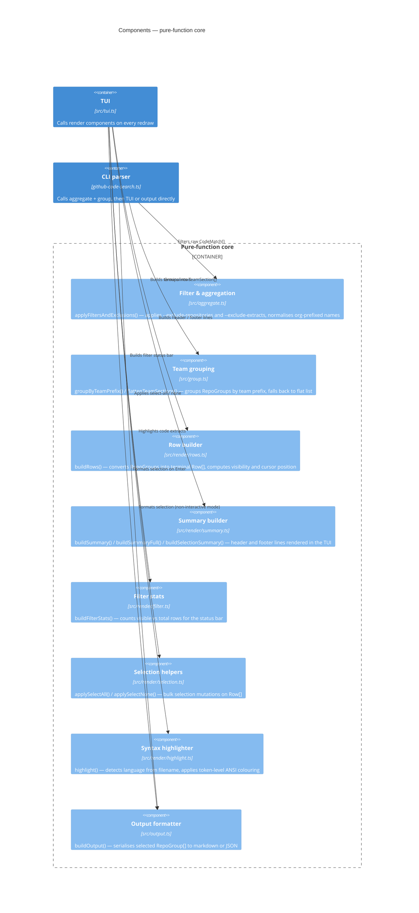

# Components (C4 L3)

This diagram zooms into the **pure-function core** — the modules that contain all
business logic with no side effects. Every component here is fully unit-tested and
takes in data structures defined in `src/types.ts`; none of them perform I/O.

The CLI parser (`github-code-search.ts`) and the TUI (`src/tui.ts`) call these
components after fetching raw data from the API.

## Component descriptions

| Component                | Source file               | Key exports                                                                                                                                                                 |
| ------------------------ | ------------------------- | --------------------------------------------------------------------------------------------------------------------------------------------------------------------------- |
| **Filter & aggregation** | `src/aggregate.ts`        | `applyFiltersAndExclusions()` — filters `CodeMatch[]` by repository and extract exclusion lists; normalises both `repoName` and `org/repoName` forms.                       |
| **Team grouping**        | `src/group.ts`            | `groupByTeamPrefix()` — groups `RepoGroup[]` into `TeamSection[]` keyed by team slug; `flattenTeamSections()` — converts back to a flat list for the TUI row builder.       |
| **Row builder**          | `src/render/rows.ts`      | `buildRows()` — converts `RepoGroup[]` into `Row[]` with expanded/collapsed state; `rowTerminalLines()` — measures wrapped height; `isCursorVisible()` — viewport clipping. |
| **Summary builder**      | `src/render/summary.ts`   | `buildSummary()` — compact header line; `buildSummaryFull()` — detailed counts; `buildSelectionSummary()` — "N files selected" footer.                                      |
| **Filter stats**         | `src/render/filter.ts`    | `buildFilterStats()` — produces the `FilterStats` object (visible count, total count, active filter string) used by the TUI status bar.                                     |
| **Selection helpers**    | `src/render/selection.ts` | `applySelectAll()` — marks all visible rows as selected; `applySelectNone()` — deselects all.                                                                               |
| **Syntax highlighter**   | `src/render/highlight.ts` | `highlight()` — maps file extension to a language token ruleset and applies ANSI escape sequences. Falls back to plain text for unknown extensions.                         |
| **Output formatter**     | `src/output.ts`           | `buildOutput()` — entry point for both `--format markdown` and `--output-type json` serialisation of the confirmed selection.                                               |

## Design principles

- **No I/O.** Every component in this layer is a pure function: given the same inputs it always returns the same outputs. This makes them straightforward to test with Bun's built-in test runner.
- **Single responsibility.** Each component owns exactly one concern (rows, summary, selection, …). The TUI composes them at render time rather than duplicating logic.
- **`types.ts` as the contract.** All components share the interfaces defined in `src/types.ts` (`TextMatchSegment`, `TextMatch`, `CodeMatch`, `RepoGroup`, `Row`, `TeamSection`, `OutputFormat`, `OutputType`). Changes to these types require updating all components.
- **`render.ts` as façade.** External consumers import from `src/render.ts`, which re-exports all symbols from the `src/render/` sub-modules plus the top-level `renderGroups()` and `renderHelpOverlay()` functions.
