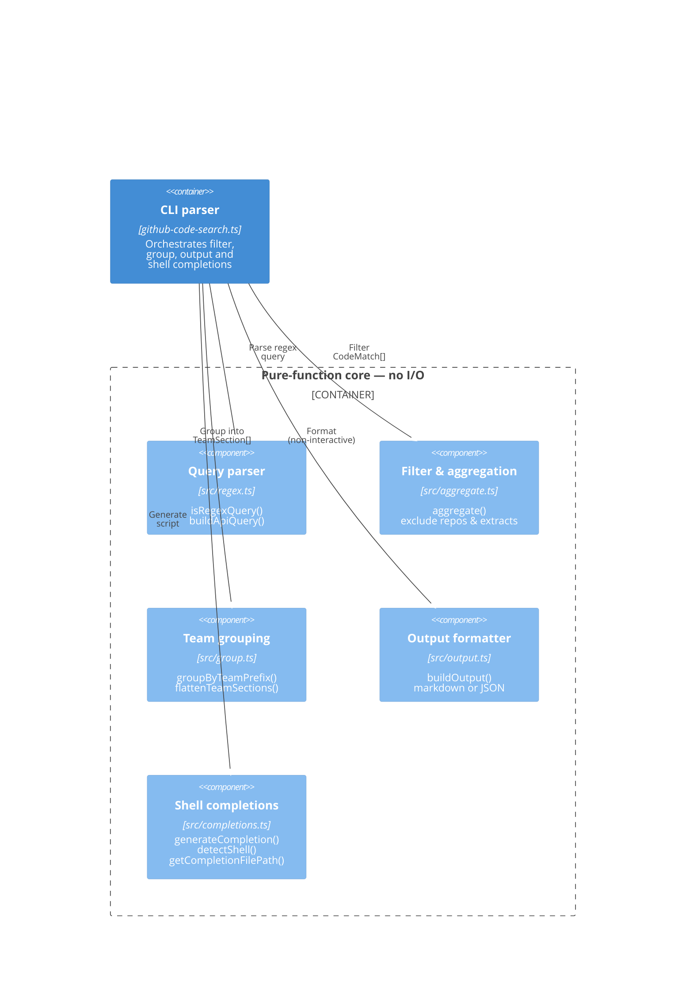
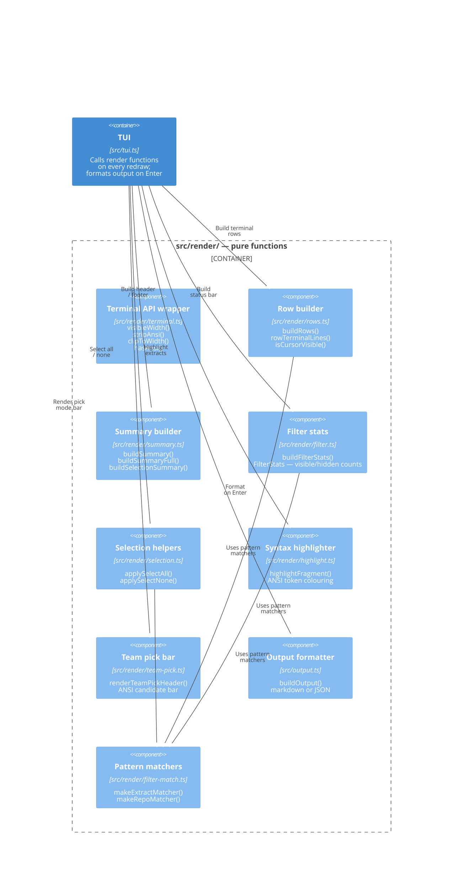

# Level 3: Components

The pure-function core is split into two focused diagrams: the **CLI data pipeline**
(filter → group → format) and the **TUI render layer** (all display components).
Every component is side-effect-free and fully unit-tested.

## 3a — CLI data pipeline

The three pure functions called by the CLI parser to transform raw API results
into a filtered, grouped, formatted output.


```mermaid
%%{init: {"theme": "base", "themeVariables": {"fontFamily": "Poppins, Aestetico, Arial, sans-serif", "primaryColor": "#9933FF", "primaryTextColor": "#ffffff", "lineColor": "#0000CC", "tertiaryColor": "#FFCC33"}, "themeCSS": ".label,.nodeLabel,.cluster-label > span{font-family:Poppins,Arial,sans-serif;letter-spacing:.2px} .cluster-label > span{font-weight:600;font-size:13px} .edgePath .path{stroke-width:2px}"}}%%
C4Component
  title Level 3a: CLI data pipeline

  UpdateLayoutConfig($c4ShapeInRow="5", $c4BoundaryInRow="1")

  Container(cli, "CLI parser", "github-code-search.ts", "Orchestrates filter,<br/>group, output and<br/>shell completions")

  Container_Boundary(core, "Pure-function core — no I/O") {
    Component(regexParser, "Query parser", "src/regex.ts", "isRegexQuery()<br/>buildApiQuery()")
    Component(aggregate, "Filter & aggregation", "src/aggregate.ts", "aggregate()<br/>exclude repos & extracts")
    Component(group, "Team grouping", "src/group.ts", "groupByTeamPrefix()<br/>flattenTeamSections()")
    Component(outputFn, "Output formatter", "src/output.ts", "buildOutput()<br/>markdown or JSON")
    Component(completions, "Shell completions", "src/completions.ts", "generateCompletion()<br/>detectShell()<br/>getCompletionFilePath()")
  }

  Rel(cli, regexParser, "Parse regex<br/>query")
  UpdateRelStyle(cli, regexParser, $offsetX="35", $offsetY="-17")

  Rel(cli, aggregate, "Filter<br/>CodeMatch[]")
  UpdateRelStyle(cli, aggregate, $offsetX="0", $offsetY="-17")

  Rel(cli, group, "Group into<br/>TeamSection[]")
  UpdateRelStyle(cli, group, $offsetX="-33", $offsetY="-17")

  Rel(cli, outputFn, "Format<br/>(non-interactive)")
  UpdateRelStyle(cli, outputFn, $offsetX="-60", $offsetY="-17")

  Rel(cli, completions, "Generate<br/>script")
  UpdateRelStyle(cli, completions, $offsetX="-90", $offsetY="-17")

```

## 3b — TUI render layer

The render-layer modules called by the TUI on every redraw. Most live in
`src/render/` and are re-exported through the `src/render.ts` façade;
`src/output.ts` is the output formatter invoked on confirmation and `src/render/filter-match.ts`
provides shared pattern-matching helpers used by several render modules.


```mermaid
%%{init: {"theme": "base", "themeVariables": {"fontFamily": "Poppins, Aestetico, Arial, sans-serif", "primaryColor": "#9933FF", "primaryTextColor": "#ffffff", "lineColor": "#0000CC", "tertiaryColor": "#FFCC33"}, "themeCSS": ".label,.nodeLabel,.cluster-label > span{font-family:Poppins,Arial,sans-serif;letter-spacing:.2px} .cluster-label > span{font-weight:600;font-size:13px} .edgePath .path{stroke-width:2px}"}}%%
C4Component
  title Level 3b: TUI render layer

  UpdateLayoutConfig($c4ShapeInRow="6", $c4BoundaryInRow="1")

  Container(tui, "TUI", "src/tui.ts", "Calls render functions<br/>on every redraw;<br/>formats output on Enter")

  Container_Boundary(render, "src/render/ — pure functions") {
    Component(terminal, "Terminal API wrapper", "src/render/terminal.ts", "visibleWidth()<br/>stripAnsi()<br/>clipToWidth()<br/>hasAnsi()")
    Component(rows, "Row builder", "src/render/rows.ts", "buildRows()<br/>rowTerminalLines()<br/>isCursorVisible()")
    Component(summary, "Summary builder", "src/render/summary.ts", "buildSummary()<br/>buildSummaryFull()<br/>buildSelectionSummary()")
    Component(filter, "Filter stats", "src/render/filter.ts", "buildFilterStats()<br/>FilterStats — visible/hidden counts")
    Component(selection, "Selection helpers", "src/render/selection.ts", "applySelectAll()<br/>applySelectNone()")
    Component(highlight, "Syntax highlighter", "src/render/highlight.ts", "highlightFragment()<br/>ANSI token colouring")
    Component(teamPick, "Team pick bar", "src/render/team-pick.ts", "renderTeamPickHeader()<br/>ANSI candidate bar")
    Component(outputFn, "Output formatter", "src/output.ts", "buildOutput()<br/>markdown or JSON")
    Component(filterMatch, "Pattern matchers", "src/render/filter-match.ts", "makeExtractMatcher()<br/>makeRepoMatcher()")
  }

  Rel(tui, rows, "Build terminal<br/>rows")
  UpdateRelStyle(tui, rows, $offsetX="-1", $offsetY="-15")

  Rel(tui, summary, "Build header <br>/ footer")
  UpdateRelStyle(tui, summary, $offsetX="-44", $offsetY="-16")

  Rel(tui, filter, "Build<br/>status bar")
  UpdateRelStyle(tui, filter, $offsetX="-64", $offsetY="-16")

  Rel(tui, selection, "Select all<br/>/ none")
  UpdateRelStyle(tui, selection, $offsetX="-105", $offsetY="-12")

  Rel(tui, highlight, "Highlight<br/>extracts")
  UpdateRelStyle(tui, highlight, $offsetX="-150", $offsetY="-16")

  Rel(tui, teamPick, "Render pick<br/>mode bar")
  UpdateRelStyle(tui, teamPick, $offsetX="-180", $offsetY="-16")

  Rel(tui, outputFn, "Format<br/>on Enter")
  UpdateRelStyle(tui, outputFn, $offsetX="17", $offsetY="160")

  Rel(rows, filterMatch, "Uses pattern<br/>matchers")
  UpdateRelStyle(rows, filterMatch, $offsetX="-5", $offsetY="-5")

  Rel(filter, filterMatch, "Uses pattern<br/>matchers")
  UpdateRelStyle(filter, filterMatch, $offsetX="45", $offsetY="-5")

  Rel(selection, filterMatch, "Uses pattern<br/>matchers")
  UpdateRelStyle(selection, filterMatch, $offsetX="165", $offsetY="-25")

```

## Component descriptions

| Component                | Source file                      | Key exports                                                                                                                                                                                                                                                                                                                                                           |
| ------------------------ | -------------------------------- | --------------------------------------------------------------------------------------------------------------------------------------------------------------------------------------------------------------------------------------------------------------------------------------------------------------------------------------------------------------------- |
| **Filter & aggregation** | `src/aggregate.ts`               | `aggregate()` — filters `CodeMatch[]` by repository and extract exclusion lists; normalises both `repoName` and `org/repoName` forms.                                                                                                                                                                                                                                 |
| **Team grouping**        | `src/group.ts`                   | `groupByTeamPrefix()` — groups `RepoGroup[]` into `TeamSection[]` keyed by team slug; `flattenTeamSections()` — converts back to a flat list for the TUI row builder; `applyTeamPick()` — moves repos from a combined section to a chosen team section; `rebuildTeamSections()` — reconstructs `TeamSection[]` from a flat list (used by TUI pick mode).              |
| **Shell completions**    | `src/completions.ts`             | `generateCompletion(shell)` — returns the full bash/zsh/fish completion script; `detectShell()` — reads `$SHELL`; `getCompletionFilePath(shell, opts)` — resolves the XDG-aware installation path.                                                                                                                                                                    |
| **Layout constants**     | `src/render/layout-constants.ts` | `getHeaderLines()` — computes visible header height based on filter mode and active filter state; Mouse button constants: `MOUSE_BUTTON_WHEEL_UP` (64), `MOUSE_BUTTON_WHEEL_DOWN` (65); Column zones: `FOLD_COLUMN_START/END`, `CHECKBOX_COLUMN_START/END`, `NAV_COLUMN_START`; Zone helpers: `isClickInFoldZone()`, `isClickInCheckboxZone()`, `isClickInNavZone()`. |
| **Row builder**          | `src/render/rows.ts`             | `buildRows()` — converts `RepoGroup[]` into `Row[]` filtered by the active target (path / content / repo); `rowTerminalLines()` — measures wrapped height; `isCursorVisible()` — viewport clipping.                                                                                                                                                                   |
| **Mouse hit-test**       | `src/render/mouse-hit.ts`        | `hitTestClick()` — maps terminal coordinates (x, y) to logical row and action (fold, select, navigate); handles full-width checkbox zone and double-click detection.                                                                                                                                                                                                  |
| **Summary builder**      | `src/render/summary.ts`          | `buildSummary()` — compact header line; `buildSummaryFull()` — detailed counts; `buildSelectionSummary()` — "N files selected" footer.                                                                                                                                                                                                                                |
| **Filter stats**         | `src/render/filter.ts`           | `buildFilterStats()` — produces the `FilterStats` object (visible repos, files, matches) used by the TUI filter bar live counter.                                                                                                                                                                                                                                     |
| **Pattern matchers**     | `src/render/filter-match.ts`     | `makeExtractMatcher()` — builds a case-insensitive substring or RegExp test function for path or content targets; `makeRepoMatcher()` — wraps the same logic for repo-name matching.                                                                                                                                                                                  |
| **Selection helpers**    | `src/render/selection.ts`        | `applySelectAll()` — marks all visible rows as selected (respects filter target); `applySelectNone()` — deselects all visible rows.                                                                                                                                                                                                                                   |
| **Syntax highlighter**   | `src/render/highlight.ts`        | `highlightFragment()` — maps file extension to a language token ruleset and applies ANSI escape sequences. Falls back to plain text for unknown extensions.                                                                                                                                                                                                           |
| **Team pick bar**        | `src/render/team-pick.ts`        | `renderTeamPickHeader()` — renders the ANSI pick-mode candidate bar shown when the user presses `p` on a multi-team section header. Focused candidate is highlighted in bold magenta; others are dimmed.                                                                                                                                                              |
| **Terminal API wrapper** | `src/render/terminal.ts`         | `visibleWidth()` — measures terminal columns (Bun.stringWidth); `stripAnsi()` — removes escape codes (Bun.stripANSI); `clipToWidth()` — truncates to N columns preserving partial reset (Bun.sliceAnsi); `hasAnsi()` — detects presence of codes. Sole authorized call site for Bun 1.4+ ANSI APIs.                                                                   |
| **Output formatter**     | `src/output.ts`                  | `buildOutput()` — entry point for both `--format markdown` and `--format json` serialisation of the confirmed selection.                                                                                                                                                                                                                                              |

## Design principles

- **No I/O.** Every component in this layer is a pure function: given the same inputs it always returns the same outputs. This makes them straightforward to test with Bun's built-in test runner.
- **Single responsibility.** Each component owns exactly one concern (rows, summary, selection, …). The TUI composes them at render time rather than duplicating logic.
- **`types.ts` as the contract.** All components share the interfaces defined in `src/types.ts` (`TextMatchSegment`, `TextMatch`, `CodeMatch`, `RepoGroup`, `Row`, `TeamSection`, `OutputFormat`, `OutputType`, `FilterTarget`). Changes to these types require updating all components.
- **`render.ts` as façade.** External consumers import from `src/render.ts`, which re-exports all symbols from the `src/render/` sub-modules plus the top-level `renderGroups()` and `renderHelpOverlay()` functions. `renderTeamPickHeader` is consumed internally by `render.ts` and is not re-exported (it is not part of the public façade).

## Mouse interaction model

The TUI supports mouse input via the terminal's SGR (Select-Graphic-Rendition) protocol, which sends click and scroll events as terminal escape sequences. Mouse and keyboard shortcuts are fully complementary: every mouse action has a keyboard equivalent.

### Protocol and coordinate mapping

- **Terminal protocol**: SGR 1006 extends basic mouse reporting (`?1000`) with extended button codes for wheel events and 8-bit-clean 1-indexed coordinates.
- **Button codes**: 0 = left click, 1 = middle, 2 = right, 64 = wheel up, 65 = wheel down.
- **Coordinate origin**: Terminal coordinates are 1-indexed from the top-left; the TUI converts them to 0-indexed logical row indices via `clickedLineOffset = y - 1 - headerLines`.
- **Header height**: The header (title, summary, filter bar) consumes 4–6 terminal rows depending on filter mode. `getHeaderLines()` computes this dynamically.

### Click zones and hit-testing

The TUI divides each row into three non-overlapping zones for different interactions:

**Repo rows** (`▸ ✓ repo-name`):

1. **Fold zone** (columns 1–2): Double-click toggles the fold state (show/hide extracts).
2. **Navigation zone** (column 3): Single-click only (move cursor). No double-click action.
3. **Checkbox zone** (columns 4+, full-width): Double-click toggles repo selection (cascades to all extracts).

**Extract rows** (`  ✓ path:line:col`):

1. **Navigation zone** (columns 1–3): Single-click only (move cursor).
2. **Checkbox zone** (columns 4+, full-width): Double-click toggles extract selection.

Each zone occupies visual terminal columns; emoji characters (▸, ✓) are 2 columns wide. Zone boundaries are defined in `layout-constants.ts`:

```
Repo row visual layout:
Column:  1   2   3   4   5   6   7  ...
Content: ▸       │   ✓       r e p o - n a m e
Zone:    └fold─┘ nav └─────checkbox─────┘
```

The full-width checkbox zone (from column 4 to screen edge) enables natural double-click selection anywhere on the row content, not just on the checkbox emoji.

### Double-click detection

Double-clicks are detected by comparing:

1. The focused row (via `getRowKey()` which combines row type and indices).
2. The time delta: less than 300 ms since the previous click on the same row.

If both conditions are met, the double-click action is executed (fold or select); otherwise, the click is treated as a single navigation action.

### Scroll and cooldown

Wheel scroll events are processed by a state machine in `scroll-cooldown.ts`:

1. **Scroll request**: Wheel up/down updates `scrollOffset` by `MOUSE_SCROLL_STEP` (3 rows).
2. **Cooldown window**: A 600 ms timer starts; all clicks are ignored during this period.
3. **Momentum scrolling**: On trackpads (macOS, Linux), scroll gestures decelerate after the wheel event. The cooldown prevents accidental clicks during this deceleration phase.

### Mouse event parsing

Mouse escape sequences are parsed in `src/render/mouse.ts` via `parseMouseEvent()`, which extracts button code and coordinates. Non-mouse input is passed to the normal keyboard handler.

### Integration with TUI state

The TUI state machine (`src/tui.ts`) integrates mouse events into the redraw loop:

1. Parse the mouse event (or keyboard input).
2. If mouse: check scroll cooldown and hit-test the click against visible rows.
3. Compute the appropriate action and update state (cursor position, selection state, fold state).
4. Redraw the screen.

All rendering state (row visibility, cursor position, selection) is independent of mouse vs. keyboard input: the view is always consistent regardless of how the user interacts with the TUI.
