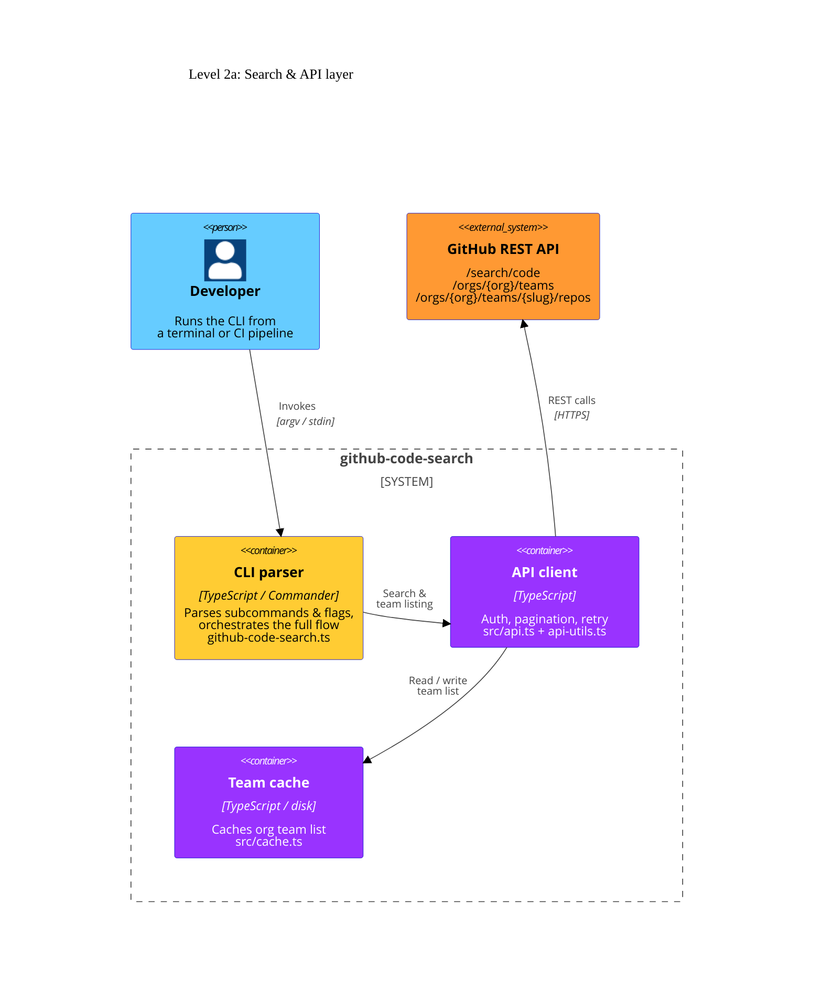
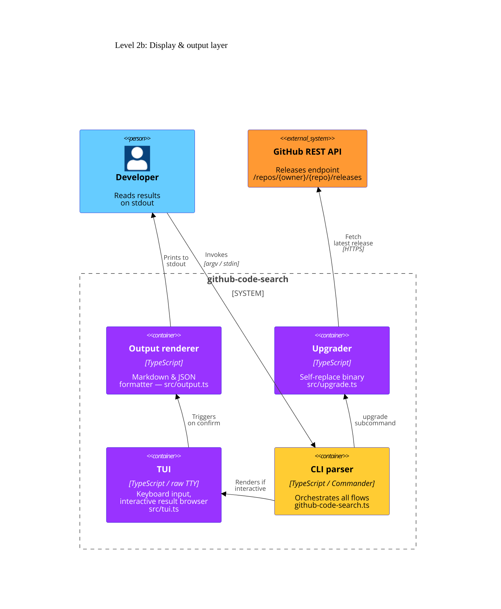

# Level 2: Containers

The containers are split across two focused diagrams to keep relations readable.
Each arrow has a single, clear crossing-free path.

## 2a — Search & API layer

How the CLI fetches data: invocation → search → cache → GitHub.

## 2b — Display & output layer

How the CLI drives the TUI for interactive use, produces output, and self-upgrades.

## Container descriptions

| Container           | Source file(s)                    | Responsibility                                                                                                                                                                                                                     |
| ------------------- | --------------------------------- | ---------------------------------------------------------------------------------------------------------------------------------------------------------------------------------------------------------------------------------- |
| **CLI parser**      | `github-code-search.ts`           | Entry point. Registers the `query` and `upgrade` Commander subcommands, resolves option defaults, and orchestrates the full search-display-output flow.                                                                            |
| **API client**      | `src/api.ts` · `src/api-utils.ts` | The only layer allowed to make network calls. Handles authentication, pagination (`paginatedFetch`), exponential-backoff retry (`fetchWithRetry`), and team/repository listing.                                                    |
| **TUI**             | `src/tui.ts`                      | The only layer allowed to read raw stdin and write directly to the TTY. Manages the keyboard event loop, cursor position, filter mode, help overlay, and selection state. Disabled when `CI=true` or `--no-interactive` is passed. |
| **Output renderer** | `src/output.ts`                   | Pure formatter. Converts the selected `RepoGroup[]` into a markdown document (`--format markdown`) or a JSON array (`--output-type json`). No I/O.                                                                                 |
| **Upgrader**        | `src/upgrade.ts`                  | Checks the latest GitHub release tag, downloads the matching binary asset, and atomically replaces the running executable.                                                                                                         |
| **Team cache**      | `src/cache.ts`                    | Persists the org team list to disk (`~/.cache/github-code-search/` on Linux, `~/Library/Caches/` on macOS) to avoid hitting the `read:org` rate limit on every run.                                                                |

## Data flow — interactive query

1. **CLI parser** receives `query` subcommand → calls **API client**.
2. **API client** queries `/search/code`, paginates, and returns `CodeMatch[]`.
3. **CLI parser** calls pure functions (`aggregate.ts`, `group.ts`) to filter and group results.
4. **TUI** receives `RepoGroup[]`, renders the browser, and waits for user input.
5. On `Enter`, **TUI** returns the selection → **CLI parser** calls **Output renderer**.
6. **Output renderer** prints markdown or JSON to stdout.
