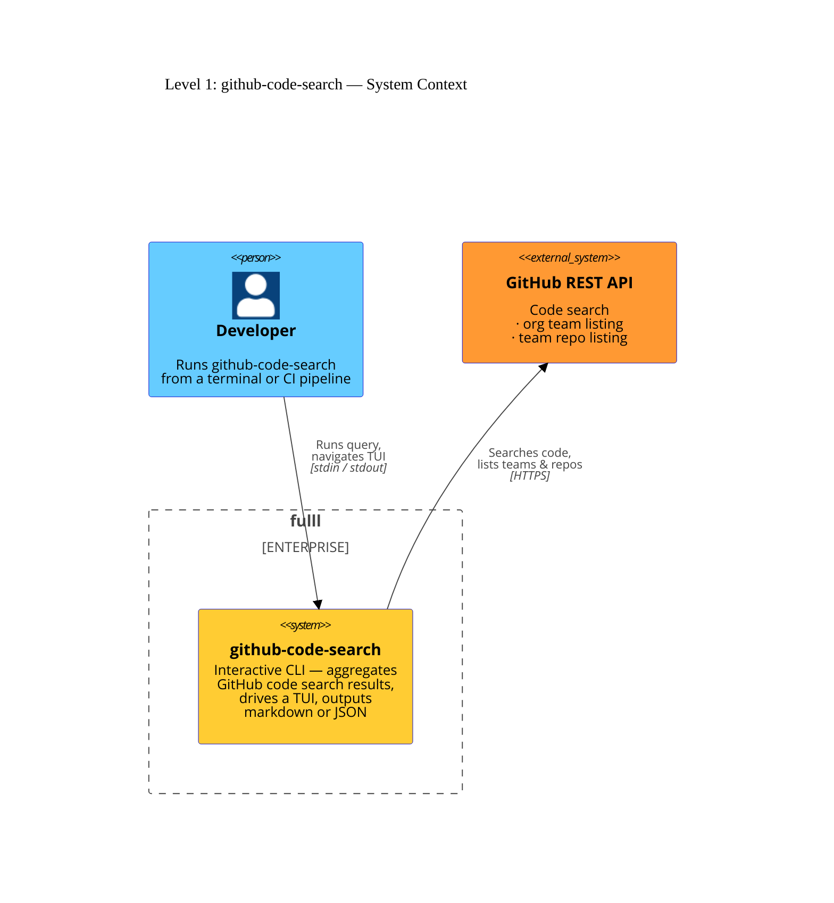

# Level 1: System context

`github-code-search` is a self-contained command-line tool. It mediates between
a developer and the GitHub REST API: the developer types a query, the tool
searches GitHub on their behalf, displays an interactive result browser, and
prints structured output so downstream tooling can consume it.

The diagram below shows the two actors and the single external dependency.

## Actors

| Actor               | Description                                                                                                                                                                                   |
| ------------------- | --------------------------------------------------------------------------------------------------------------------------------------------------------------------------------------------- |
| **Developer**       | The person (or CI job) that invokes the tool. Provides a `GITHUB_TOKEN` and a search query; receives markdown or JSON on stdout.                                                              |
| **GitHub REST API** | The only external system the tool communicates with. The tool uses three endpoints: code search, org team list, and team repo list. All calls are authenticated with a personal access token. |

## Authentication

The tool reads `GITHUB_TOKEN` from the environment. The required OAuth scopes vary by feature:

- **Basic search** — `public_repo` (public) or `repo` (private repos)
- **Team grouping** (`--group-by-team-prefix`) — additionally requires `read:org`

See the [Environment variables](/reference/environment) reference for the full scope table.
